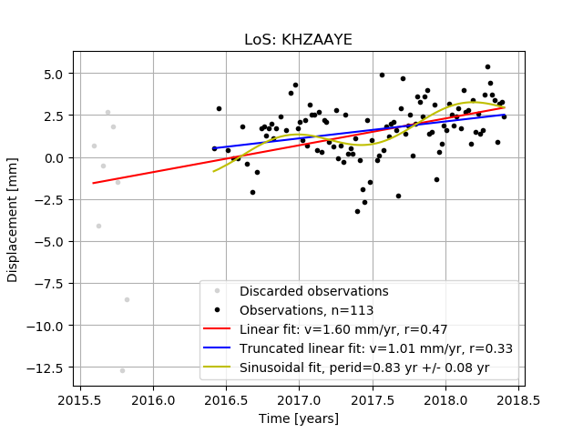
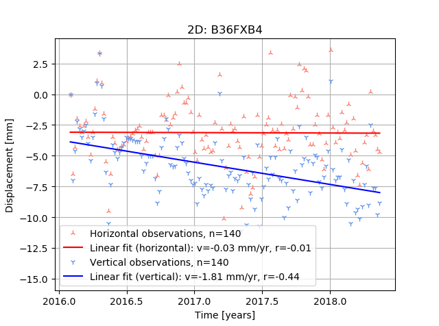

# Probabilistic InSAR Time Series Analysis

Tool(s) for working with InSAR time series data from TRE.

PITSA reorganizes shapefiles of SqueeSAR data from TRE. Measuring 
points (MPs) and their attributes are stored in a geopackage file,
as well as additional statistics calculated by PITSA. An optional 
timeseries database can also be created. This is necessary to use
the plotting features in PITSA.

## Usage

PITSA is a single entry-point application with several sub-commands. Here's
the help text for the main application:

```
(pitsa) C:\dev\pitsa>subl README.md

(pitsa) C:\dev\pitsa>pitsa --help
'pitsa' is not recognized as an internal or external command,
operable program or batch file.

(pitsa) C:\dev\pitsa>python pitsa.py --help
Usage: pitsa.py [OPTIONS] COMMAND [ARGS]...

  PITSA - Probabilistic InSAR Time Series Analysis

Options:
  --start TEXT  Start date of time series. On the form "YYYY-MM-DD".
  --stop TEXT   Stop date of time series. On the form "YYYY-MM-DD".
  --help        Show this message and exit.

Commands:
  createdb  Create a Geopackage database from the base directory of a...
  plot2d    Plot time series and related fits for a given point Example...
  plotlos   Plot time series and related fits for a given point Example...

```

### Create database

To create a new geopackage database of all the MPs in the SqueeSAR
dataset the `createdb` subcommand can be used. PITSA expects the
SqueeSAR data to be organized in the following folder structure:

```
base\
  LOS\
  2D\
```

Where flies in the `LOS` folder should follow the naming convention:
`DENMARK_SNT_T<track_no>_<geometry>_<sensorinfo>.shp` and
`DENMARK_SNT_T<track_no>_<geometry>_<sensorinfo>_CAL_GNSS.shp`, e.g.
`DENMARK_SNT_T117_A_IT902A5S.shp` and `
DENMARK_SNT_T117_A_IT902A5S_CAL_GNSS.shp`. Note that LOS files come
in pairs of two, with one being uncalibrated data and the other being
GNSS calibrated data.

In the `2D` folder the following files are expected:

```
DENMARK_SNT_EAST_IT902B3E.shp
DENMARK_SNT_VERT_IT902B1V.shp
DENMARK_SNT_VERT_CAL_UPLIFT_IT902B2V.shp
```

The help text for the `createdb` subcommand is as follows:

```

(pitsa) C:\dev\pitsa>python pitsa.py createdb --help
Usage: pitsa.py createdb [OPTIONS] BASEDIR DATA

  Create a Geopackage database from the base directory of a delivery from
  TRE

Options:
  --ts PATH  Path to Geopackage where times series are stored
  --help     Show this message and exit.
```

As an example `createdb` can be called with:

```
(pitsa) C:\dev\pitsa>python pitsa.py createdb insar.gpkg --ts ts.gpkg
```

which will create both a geopackage holding the MPs and a geopackage
containing all time series for said MPs.

### Plots

The `plot*` commands open a window with a plot of a time series and some
relevant statistics for a particular point in the input dataset.
The help text for the `plotlos` subcommand is as follows:

```
(pitsa) C:\dev\pitsa>python pitsa.py plotlos --help
Usage: pitsa.py plotlos [OPTIONS] DATABASE CODE

  Plot time series and related fits for a given point

  Example points:

      KHZAAYE

Options:
  -c, --calibrated  Plot based on calibrated values
  --help            Show this message and exit.
```

and here is an example call:

```
(pitsa) python pitsa.py plotlos ts.gpkg KHZAAYE
```

which result in the following plot:



Similarly a plot of a 2D timeseries can be made with



## Installation

The application is best run from the Anaconda python environment. First, create a new env:

```
> conda env create -f environment.yml
```

In the `pitsa` directory you can now run PITSA:

```
> python pitsa.py ...
```


# QGIS integration

Rudimentary QGIS integration is also included with PITSA.
in `qgis_styles` a few style files are stored that can be used to
quickly set up layers of the MP dataset. Simply add layers from
the MP geopackage file and add the style (right click the layer,
select properties, find the style-button and select "load style").
Once a style is added to a layer it is possible to plot the time
series of the point by right clicking using the info tool and
selecting "plot time series ...".

For this to work you need to make sure that the path to the time
series database in the pythoncode that invokes the plots is correct.
For each layer go to properties -> Actions and double-click an
action. This opens the code editor where the path of `DB` should be
changed to fit your setup.

It may be necessary to install `matplotlib` and `scipy` in your QGIS
Python environment. In a OSGeo4W installtion this can be done from
the OSGeo4W shell by running `pip install matplotlib scipy`.